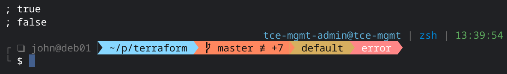

# `oh-my-posh` Theme
Requires [oh-my-posh](https://ohmyposh.dev/), which lets you use the same prompt theme across any shell. I use this theme primarily for `zsh` and `pwsh` on both Windows and Linux.

- **Minimal(ish)**: Works best with [Powerline fonts](https://github.com/powerline/fonts) but doesn't require the extended [Nerd Fonts](https://github.com/ryanoasis/nerd-fonts) symbol set.
- **Transient prompt**: Prompt in shell history is collapsed to `;` to save screen space *and* allow for safe copy/pasting.
- **Remote indicator**: ❏ on the left side of the prompt indicates an SSH shell. 
- **Short working path**: Displays the full name of the current directory while folders further up the tree collapse to as few characters as can uniquely identify them.
- **Git status**: Shows current branch as well as pending changes.
- **Terraform workspace**: Name of the current Terraform workspace.
- **Error indicator**: Alerts when the last command has a non-zero exit code.
- **Execution timer**: Displays execution time for last command (when >500ms).
- **`kubectl` context**: Current Kubernetes context.
- **Current shell**: Also differentiates between major versions of PowerShell (5/6/7).
- **Clock**: How else will you know what time it is?
